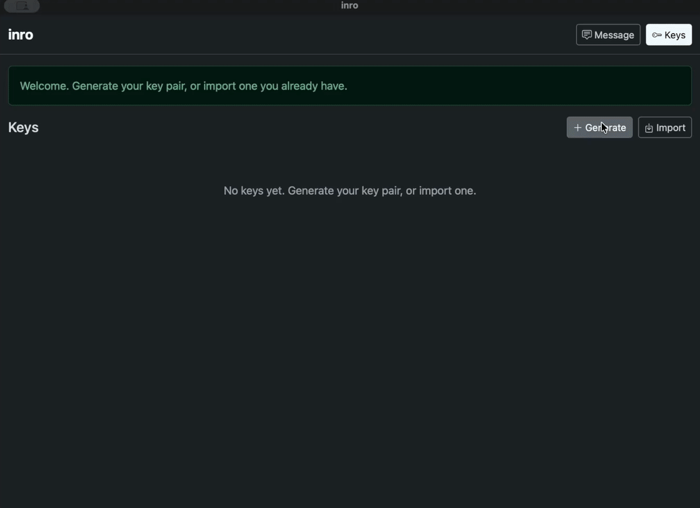

# inro

Self-contained PGP for the desktop: encrypt, sign, verify and decrypt
messages, and keep the keys of the people you write to. The OpenPGP engine is
built in — nothing else to install, and gpg is never needed.



An *inro* (印籠) is the small case that used to hang from an obi to carry a
personal seal and its ink. This one carries yours.

Go, cgo-free. The window is [glaze](https://github.com/crgimenes/glaze) (the
platform webview via purego), the UI is embedded HTML, the crypto is
[ProtonMail/go-crypto](https://github.com/ProtonMail/go-crypto), and the
configuration is [Filo](https://github.com/crgimenes/filo). One binary, no
files alongside it.

## Install

On macOS, with [Homebrew](https://brew.sh):

```sh
brew install --cask crgimenes/tap/inro
```

Or take a binary from the [releases page](https://github.com/crgimenes/inro/releases):
the macOS app is signed and notarized, Windows and Linux get plain
executables. Building from source needs only Go — no C toolchain on any
platform:

```sh
go install github.com/crgimenes/inro@latest
```

inro carries its own crypto and UI; the one thing it borrows from the system
is the webview the OS already ships. macOS has it, Windows uses the Edge
WebView2 runtime (present on any current Windows), and Linux needs GTK with
WebKitGTK (`libwebkit2gtk-4.1` or GTK 4's `libwebkitgtk-6.0` — one package
install).

## Use

On first run inro opens the **Keys** page: generate your key pair right
there — EdDSA/Curve25519, an expiry if you want one, and a passphrase set in
a confirm-twice window with an honest strength estimate — or import keys you
already have: paste an armored key or open a `.asc` file. Keys exported from
gpg import fine (`gpg --armor --export-secret-keys you@example.com`).

Each key has its own page: nickname and note, export, delete — and
**certification**: sign a friend's key with yours to state that you checked
it really belongs to them. Certifications travel with the exported key, and
inro shows who, among the keys you hold, vouches for each one.

Then everything happens on the **Message** page: one text field, like a
translator with a single box. There is no mode to choose and usually nothing
to click, because what lands in the field already decides what happens to it:

- **A signed message** is verified the moment it is pasted, and the readable
  text takes its place. Zero clicks.
- **An encrypted message** names its own recipients, so inro finds which of
  your keys opens it by itself. If that key needs no passphrase — or you
  typed it recently — the message is decrypted on the spot; otherwise the
  only question inro ever asks, the passphrase, appears in its own window,
  pinentry-style: a wrong one is reported right there and the window stays
  for another try. Messages protected by a shared passphrase instead of a
  key work too.
- **Plain text** goes out: pick recipients to *Encrypt*, flip *Sign as* to
  sign, or both. The armored result replaces your text, selected and ready
  to copy — with a link to restore the original if you still need it.

Open loads a message from a file; Save writes the field to one. The same
actions live in the application menu, and Cmd/Ctrl+Enter runs the primary
action from anywhere.

Any signature found while decrypting or verifying is reported above the
result. A signature only reports as valid when the signer's key is in your
keyring. "Valid" here means the message was not altered and it was signed by
that key — whether the key really belongs to who it claims to is still on you.

Your passphrase is never stored. After you type it, the unlocked key stays in
memory for `KeyCacheSeconds` (default 5 minutes, 0 disables the cache) so a
burst of work asks once; after it expires, operations ask again.

## Files

```
~/.config/inro/
  init.filo        ; configuration (optional)
  keyring.filo     ; nicknames and notes
  keys/
    <FINGERPRINT>.asc
```

Keys are stored in PGP's own armored format, one file per key, so
`gpg --import ~/.config/inro/keys/*.asc` works and nothing is locked inside
this app. `keyring.filo` holds only what the key material cannot carry — the
nickname and note you attach to a key — so the two can never disagree about a
fingerprint or a user ID.

`$XDG_CONFIG_HOME` is honoured. An `inro_init.filo` in the working directory
takes precedence over `~/.config/inro/init.filo`.

## Configuration

Every setting is optional; the defaults are shown.

```lisp
(set Width 1024)
(set Height 720)
(set Debug #f)                       ; open the webview developer tools
(set DataDir "~/.config/inro")       ; where keys and metadata live
(set DefaultKey "")                  ; fingerprint pre-selected in the UI
(set KeyCacheSeconds 300)            ; how long a typed passphrase keeps the key unlocked
```

## Status

Early but whole: key generation (with expiry), import/export/delete,
certification, encrypt, decrypt (including passphrase-protected messages),
sign, verify, automatic key selection, and the unlocked-key cache all work.
Not there yet: key revocation, extending expiry on an existing key.
